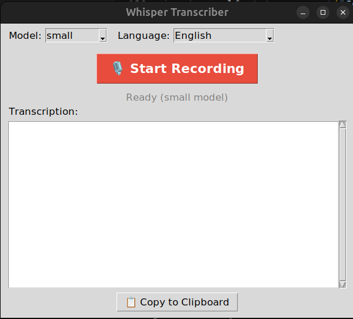

# 🎙 Whisper Local

A lightweight Linux desktop app for offline speech-to-text using [OpenAI Whisper](https://github.com/openai/whisper). Supports English, German, and Tamil. Everything runs locally — no API key, no internet required after setup.

---

## Requirements

- Linux (Ubuntu/Debian)
- Python 3.12+
- A microphone

---

## Installation

### 1. Clone the repo

```bash
git clone https://github.com/yourusername/whisper_local.git
cd whisper_local
```

### 2. Install system dependencies

```bash
sudo apt install python3.12-venv portaudio19-dev ffmpeg
```

### 3. Create a virtual environment

This keeps everything isolated inside the project folder — nothing is installed globally.

```bash
python3 -m venv .venv
source .venv/bin/activate
```

Your terminal should now show `(.venv)` at the start. You can confirm the venv is active by running:

```bash
which python3
# should return: /path/to/whisper_local/.venv/bin/python3
```

### 4. Install Python dependencies

```bash
pip install faster-whisper sounddevice numpy scipy
```

### 5. Set the model cache location (optional but recommended)

By default the Whisper model (~500MB for `small`) downloads to `~/.cache`. To keep it inside the project folder instead:

```bash
export HF_HOME=/full/path/to/whisper_local/.cache
```

To make this permanent, add it to your `~/.bashrc`:

```bash
echo 'export HF_HOME=/full/path/to/whisper_local/.cache' >> ~/.bashrc
source ~/.bashrc
```

---

## Running the App

Make sure your venv is active, then:

```bash
python whisper_app.py
```

The first time you run it, the Whisper model will download automatically (~500MB for `small`). After that it runs fully offline.

---

## Usage

1. Select your **language** (English, German, Tamil)
2. Optionally change the **model size** (see below)
3. Click **🎙 Start Recording** and speak
4. Click **⏹ Stop & Transcribe** when done
5. Click **📋 Copy to Clipboard** to copy the result

---

## Model Sizes

| Model  | Size   | Speed   | Accuracy |
|--------|--------|---------|----------|
| tiny   | ~75MB  | Fastest | Lower    |
| base   | ~142MB | Fast    | OK       |
| small  | ~466MB | Good    | Good ✅  |
| medium | ~1.5GB | Slower  | High     |
| large  | ~2.9GB | Slowest | Best     |

`small` is the default and works well for most use cases.

---

## Creating a Launcher (optional)

To launch the app like a regular Linux desktop app without opening a terminal:

### 1. Create a run script

```bash
touch run.sh
chmod +x run.sh
```

Paste this into `run.sh` (replace with your actual path):

```bash
#!/bin/bash
export HF_HOME=/full/path/to/whisper_local/.cache
source /full/path/to/whisper_local/.venv/bin/activate
python /full/path/to/whisper_local/whisper_app.py
```

### 2. Create a .desktop file

```bash
nano ~/.local/share/applications/whisper.desktop
```

Paste this (update the path):

```ini
[Desktop Entry]
Name=Whisper Transcriber
Comment=Local speech to text
Exec=/full/path/to/whisper_local/run.sh
Icon=audio-input-microphone
Terminal=false
Type=Application
Categories=Utility;
```

Then make it executable and refresh the launcher:

```bash
chmod +x ~/.local/share/applications/whisper.desktop
update-desktop-database ~/.local/share/applications/
```

The app will now appear in your application launcher after logging out and back in.

---

## Project Structure

```
whisper_local/
├── .venv/            # Python virtual environment (not committed to git)
├── .cache/           # Whisper model weights (not committed to git)
├── whisper_app.py    # Main app
├── run.sh            # Launch script
└── README.md
```

## Final app layout


